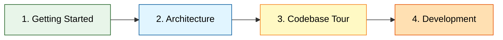

# Systech AIDD Bot - Documentation

Центральная точка доступа ко всей документации проекта.

## 📖 Documentation Guides

**Полный набор гайдов для работы с проектом:**

→ **[Guides Index](guides/README.md)** - начните здесь для изучения проекта

### Быстрые ссылки на гайды:

| Гайд | Описание |
|------|----------|
| [Getting Started](guides/01_getting_started.md) | Быстрый старт за 5 минут |
| 🎨 [Visual Architecture](guides/02_visual_architecture.md) | **12 типов диаграмм** - визуализация архитектуры |
| [Architecture Overview](guides/03_architecture_overview.md) | Обзор архитектуры с диаграммами |
| [Codebase Tour](guides/04_codebase_tour.md) | Guided tour по коду |
| [Configuration & Secrets](guides/07_configuration_secrets.md) | Настройка конфигурации |
| [Development Workflow](guides/08_development_workflow.md) | Day-to-day разработка |
| [Testing Guide](guides/09_testing_guide.md) | Как писать тесты |

---

## 📚 Project Documentation

### Core Documents

- **[Vision](vision.md)** - техническое видение проекта
  - Технологии
  - Принципы разработки
  - Архитектура
  - Модель данных
  - LLM интеграция

- **[Conventions](conventions.md)** - соглашения по разработке
  - SOLID принципы
  - Type safety
  - Тестирование
  - Форматирование
  - Git workflow

### Development Plans

- **[Task List](tasklist.md)** - план основной разработки
  - 6 итераций (все завершены ✅)
  - От базовой инфраструктуры до ролевой специализации

- **[Tech Debt Task List](tasklist_tech_dept.md)** - план устранения техдолга
  - 5 итераций (все завершены ✅)
  - От инструментов качества до unit-тестов

### Reviews

- **[Review #0001](reviews/review_0001.md)** - полное ревью проекта
  - Общая оценка: 9/10 ✅
  - Coverage: 81.58%
  - 56 тестов (все зелёные)

---

## 🎯 Quick Start

**Новый в проекте?** Следуйте этому пути:



1. **[Getting Started](guides/01_getting_started.md)** - установите и запустите
2. **[Architecture Overview](guides/03_architecture_overview.md)** - поймите как устроено
3. **[Codebase Tour](guides/04_codebase_tour.md)** - изучите структуру кода
4. **[Development Workflow](guides/08_development_workflow.md)** - начните разработку

---

## 🏗️ Project Overview

### Тип приложения
Telegram-бот с AI-ассистентом (роль: нутрициолог)

### Технологии
- Python 3.11+, aiogram 3.x, OpenAI SDK
- Openrouter API для LLM
- Pydantic для конфигурации
- Pytest для тестирования

### Архитектура
- SOLID принципы
- Protocol для DIP
- Строгая типизация (mypy strict)
- In-memory хранение истории

### Качество кода
- Coverage: 81.58% (цель: ≥70%) ✅
- 56 unit-тестов (все зелёные) ✅
- Ruff (форматтер + линтер)
- MyPy (type checker)

---

## 📊 Documentation Structure

```
docs/
├── README.md                          # Этот файл (главный индекс)
├── guides/
│   ├── README.md                     # Индекс гайдов
│   ├── 01_getting_started.md
│   ├── 03_architecture_overview.md
│   ├── 04_codebase_tour.md
│   ├── 07_configuration_secrets.md
│   ├── 08_development_workflow.md
│   └── 09_testing_guide.md
├── vision.md                          # Техническое видение
├── conventions.md                     # Соглашения разработки
├── tasklist.md                        # План основных итераций
├── tasklist_tech_dept.md              # План техдолга
├── idea.md                            # Идея проекта
└── reviews/
    └── review_0001.md                 # Код-ревью
```

---

## 🔍 Quick Reference

### Common Commands

```bash
# Setup
make install                # Установить зависимости

# Running
make run                    # Запустить бота

# Quality
make format                 # Форматирование
make lint                   # Линтинг
make typecheck              # Type checking
make test                   # Тесты
make quality                # Полная проверка
```

### Project Structure

```
systech-aidd/
├── main.py                 # Точка входа
├── src/                    # Исходный код (9 модулей)
├── tests/                  # Тесты (56 unit-тестов)
├── prompts/                # Системные промпты
├── docs/                   # Документация
├── pyproject.toml          # Конфигурация
├── Makefile                # Команды
└── .env                    # Секреты (не в git)
```

### Key Modules

- `bot.py` - Telegram bot координация
- `command_handler.py` - команды (/start, /help, /clear, /role)
- `message_handler.py` - обработка текстовых сообщений
- `llm_client.py` - интеграция с Openrouter API
- `conversation.py` - история диалогов (in-memory)
- `config.py` - конфигурация (Pydantic)
- `protocols.py` - Protocol интерфейсы (DIP)
- `types.py` - TypedDict структуры

---

## 🎓 For Different Roles

### Новый разработчик
1. [Getting Started](guides/01_getting_started.md)
2. [Architecture Overview](guides/03_architecture_overview.md)
3. [Development Workflow](guides/08_development_workflow.md)
4. [Conventions](conventions.md)

### Reviewer
1. [Conventions](conventions.md) - что проверять
2. [Review #0001](reviews/review_0001.md) - пример ревью
3. [Testing Guide](guides/09_testing_guide.md) - как должны быть покрыты тесты

### Tech Lead
1. [Vision](vision.md) - техническое видение
2. [Architecture Overview](guides/03_architecture_overview.md) - архитектура
3. [Task Lists](tasklist.md) - завершенные итерации

### DevOps
1. [Getting Started](guides/01_getting_started.md) - как запускать
2. [Configuration & Secrets](guides/07_configuration_secrets.md) - environment vars
3. [Codebase Tour](guides/04_codebase_tour.md) - структура проекта

---

## 📈 Project Status

**Стадия:** MVP завершен, готов к production

**Итерации:**
- ✅ 6/6 основных итераций завершены
- ✅ 5/5 итераций техдолга завершены

**Качество:**
- ✅ Coverage 81.58% (цель: ≥70%)
- ✅ 56 тестов (все зелёные)
- ✅ MyPy strict mode проходит
- ✅ Ruff форматирование соблюдено

**Последнее ревью:** [Review #0001](reviews/review_0001.md) (2025-10-11) - оценка 9/10

---

## 🤝 Contributing

При работе с проектом:

1. **Читайте [Conventions](conventions.md)** перед началом
2. **Следуйте [Development Workflow](guides/08_development_workflow.md)**
3. **Пишите тесты** ([Testing Guide](guides/09_testing_guide.md))
4. **Запускайте `make quality`** перед коммитом
5. **Обновляйте документацию** при изменениях

---

## 📝 Documentation Principles

При обновлении документации:

- ✅ Краткость и простота
- ✅ Только текущее состояние (не планы на будущее)
- ✅ Mermaid диаграммы где уместно
- ✅ Без оверинжиниринга
- ✅ Системность и структурированность

---

**Версия документации:** 1.0  
**Последнее обновление:** 2025-10-16  
**Проект:** Systech AIDD Bot

