# Visual Architecture Guide

Визуальное представление архитектуры проекта с разных точек зрения.

---

## 🏗️ High-Level Architecture

**Общая архитектура системы:**

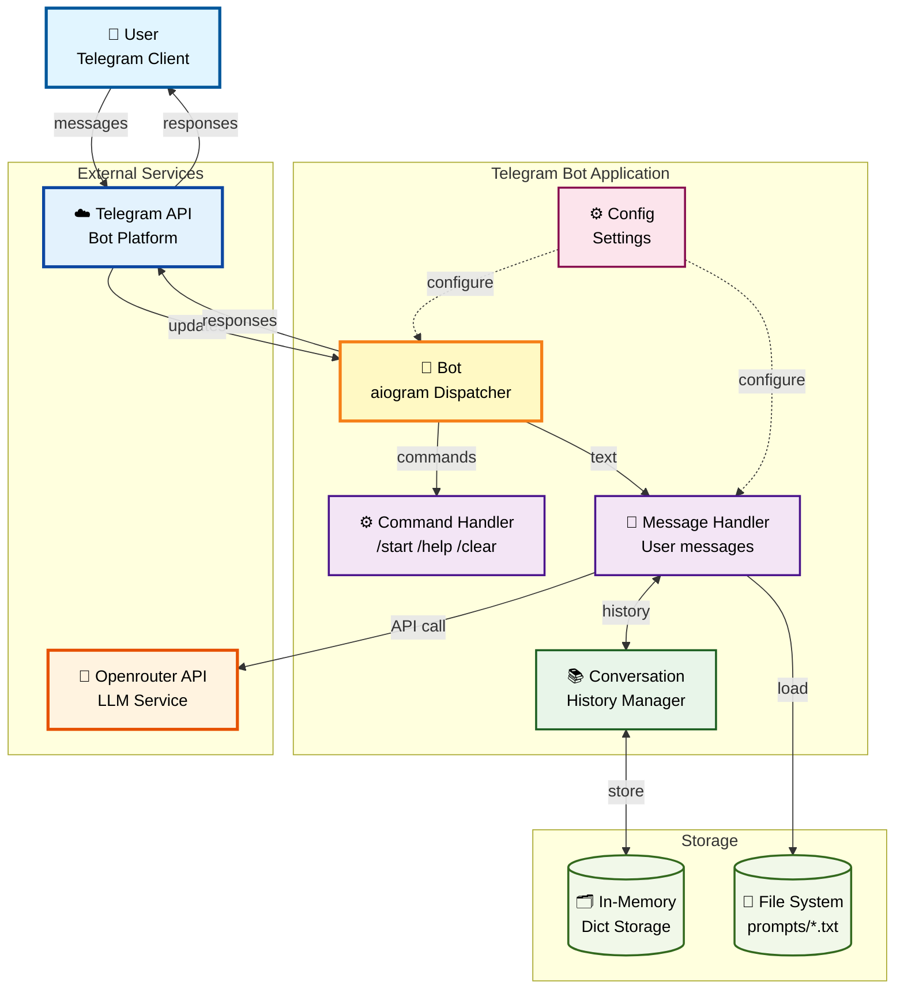

---

## 🔄 Message Flow (Sequence Diagram)

**Полный цикл обработки сообщения пользователя:**

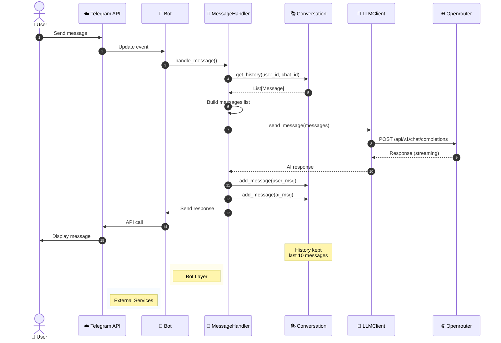

---

## 🗂️ Component Architecture

**Компоненты и их взаимосвязи:**

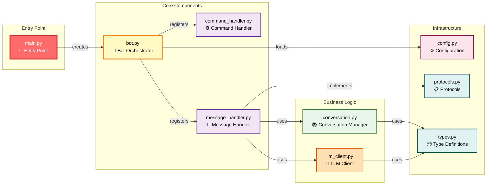

---

## 🎯 Class Diagram

**Основные классы и их отношения:**

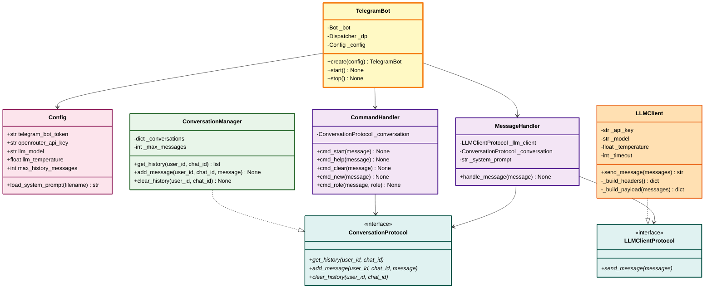

---

## 📊 Data Flow Diagram

**Потоки данных в системе:**

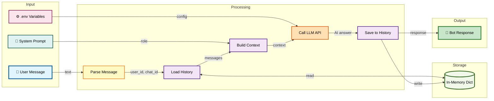

---

## 🔁 Conversation State Machine

**Состояния диалога:**

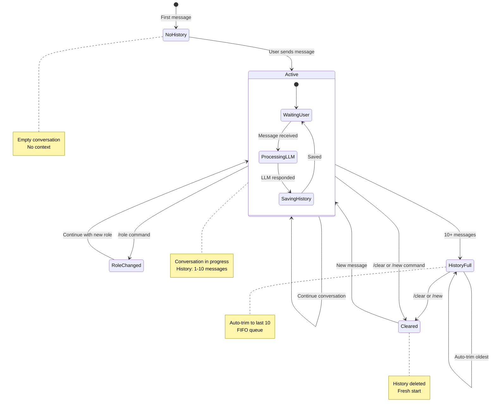

---

## 🚀 Deployment View

**Как развернута и запущена система:**

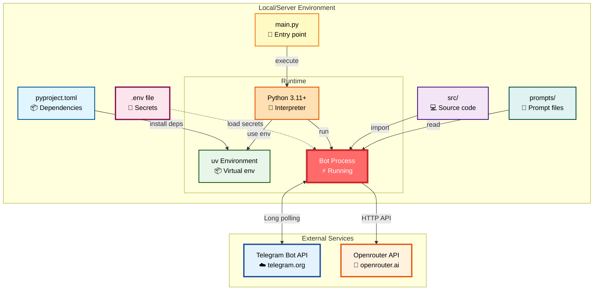

---

## 👤 User Journey

**Путь пользователя от старта до диалога:**

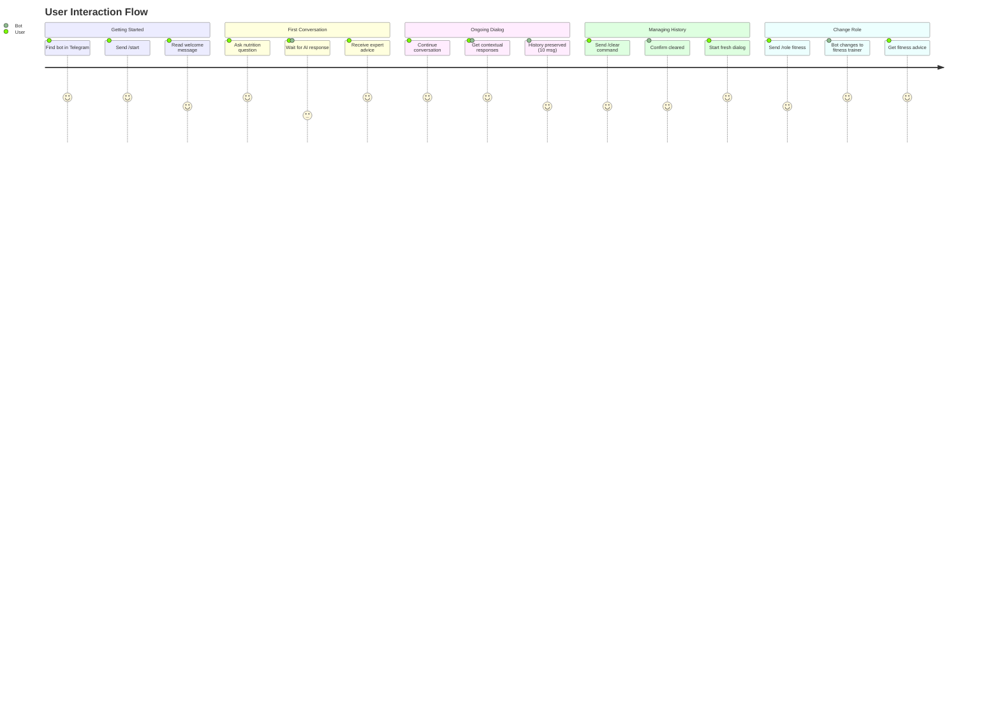

---

## 🧩 Module Dependencies

**Зависимости между модулями:**

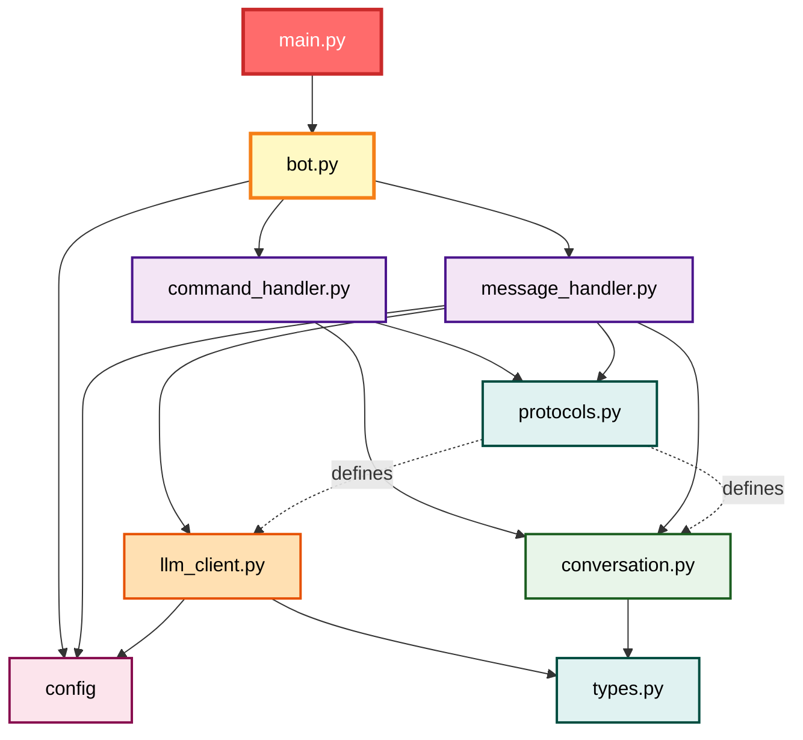

---

## 🔧 Configuration Flow

**Как загружается и используется конфигурация:**

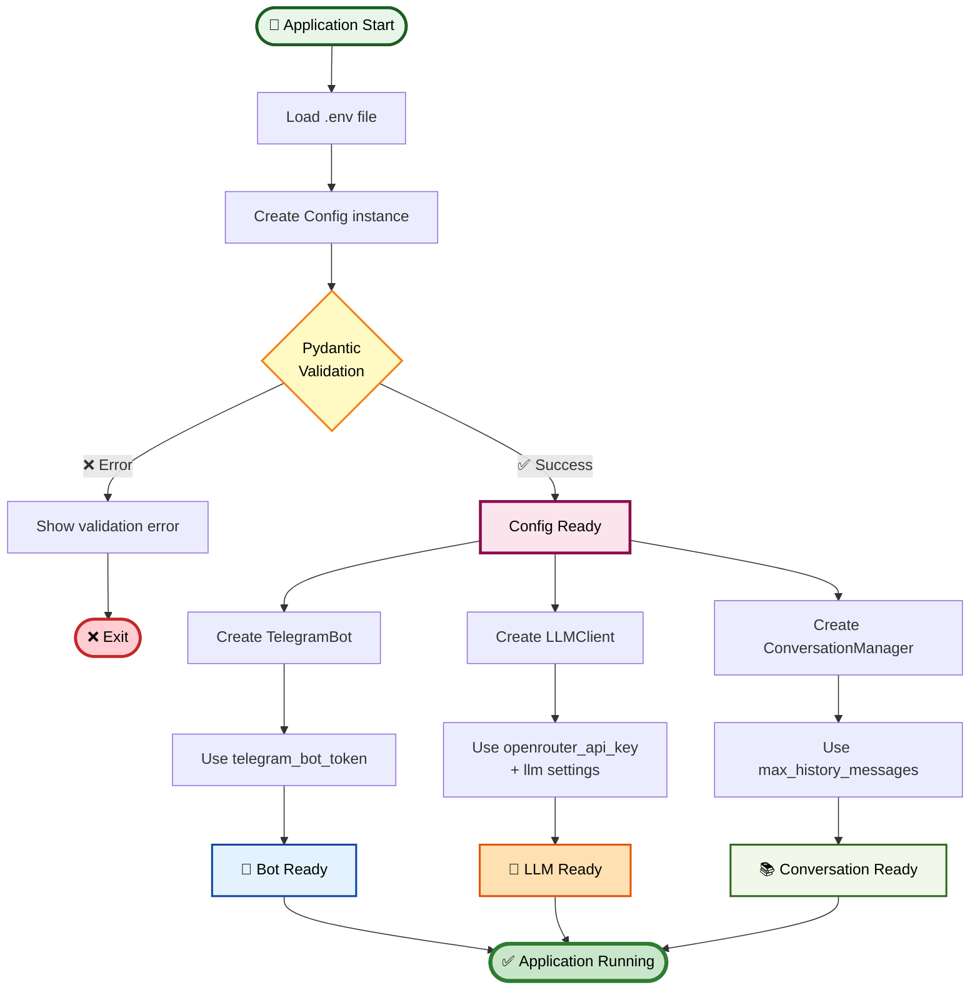

---

## 📦 Technology Stack

**Технологический стек проекта:**

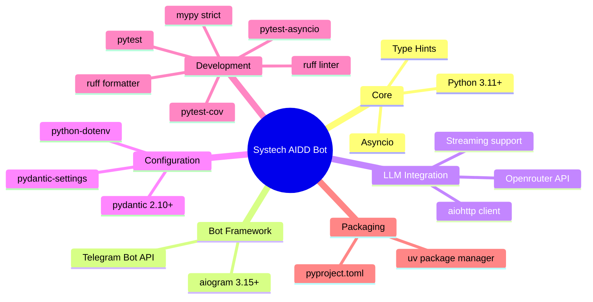

---

## 🎨 Design Patterns Used

**Применяемые паттерны проектирования:**

```mermaid
graph TB
    subgraph "Structural Patterns"
        Facade[🎭 Facade<br/>TelegramBot class<br/>Hides aiogram complexity]
        DI[💉 Dependency Injection<br/>Protocols injected<br/>into handlers]
    end
    
    subgraph "Behavioral Patterns"
        Strategy[🎯 Strategy<br/>Different role prompts<br/>Change behavior]
        Observer[👁️ Observer<br/>aiogram handlers<br/>React to events]
    end
    
    subgraph "Creational Patterns"
        Factory[🏭 Factory Method<br/>TelegramBot.create()<br/>Bot initialization]
        Singleton[👑 Singleton-like<br/>Single config instance<br/>Global settings]
    end
    
    subgraph "SOLID Principles"
        SRP[S: Single Responsibility<br/>Each class = 1 purpose]
        OCP[O: Open/Closed<br/>Protocol extensions]
        LSP[L: Liskov Substitution<br/>Protocol implementations]
        ISP[I: Interface Segregation<br/>Small focused protocols]
        DIP[D: Dependency Inversion<br/>Depend on protocols]
    end
    
    Facade -.->|enables| SRP
    DI -.->|implements| DIP
    Strategy -.->|supports| OCP
    Observer -.->|follows| OCP
    
    style Facade fill:#e1f5ff,stroke:#01579b,stroke-width:2px,color:#000
    style DI fill:#f3e5f5,stroke:#4a148c,stroke-width:2px,color:#000
    style Strategy fill:#fff9c4,stroke:#f57f17,stroke-width:2px,color:#000
    style Observer fill:#ffe0b2,stroke:#e65100,stroke-width:2px,color:#000
    style Factory fill:#e8f5e9,stroke:#1b5e20,stroke-width:2px,color:#000
    style Singleton fill:#fce4ec,stroke:#880e4f,stroke-width:2px,color:#000
    style SRP fill:#c8e6c9,stroke:#2e7d32,stroke-width:2px,color:#000
    style OCP fill:#c8e6c9,stroke:#2e7d32,stroke-width:2px,color:#000
    style LSP fill:#c8e6c9,stroke:#2e7d32,stroke-width:2px,color:#000
    style ISP fill:#c8e6c9,stroke:#2e7d32,stroke-width:2px,color:#000
    style DIP fill:#c8e6c9,stroke:#2e7d32,stroke-width:2px,color:#000
```

---

## 🔍 Quick Visual Reference

| Диаграмма | Что показывает | Когда использовать |
|-----------|----------------|-------------------|
| **High-Level Architecture** | Общая структура системы | Объяснить архитектуру новичку |
| **Message Flow** | Последовательность обработки | Понять порядок вызовов |
| **Component Architecture** | Зависимости модулей | Найти нужный компонент |
| **Class Diagram** | Классы и их связи | Понять ООП структуру |
| **Data Flow** | Потоки данных | Проследить данные |
| **State Machine** | Состояния диалога | Понять lifecycle |
| **Deployment** | Окружение запуска | Развернуть проект |
| **User Journey** | UX флоу | Понять пользователя |
| **Module Dependencies** | Импорты модулей | Рефакторинг |
| **Configuration Flow** | Загрузка настроек | Debug конфигурации |
| **Tech Stack** | Используемые технологии | Онбординг разработчика |
| **Design Patterns** | Паттерны проектирования | Понять архитектурные решения |

---

## 📖 Navigation

- [← Back to Guides](README.md)
- [Getting Started →](01_getting_started.md)
- [Architecture Overview →](03_architecture_overview.md)


