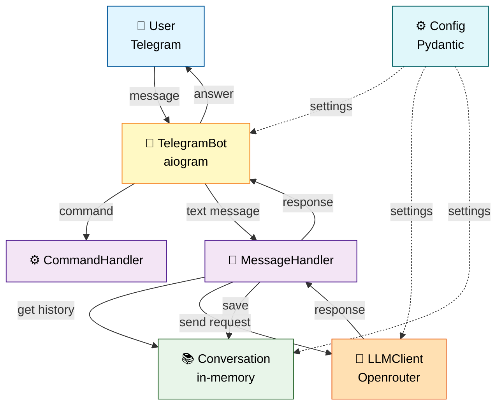
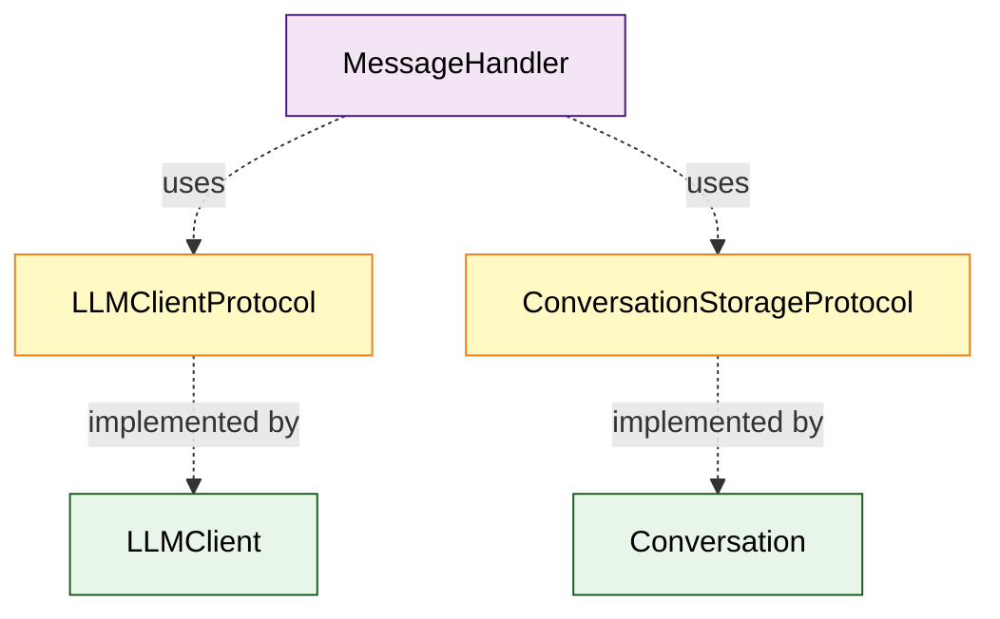
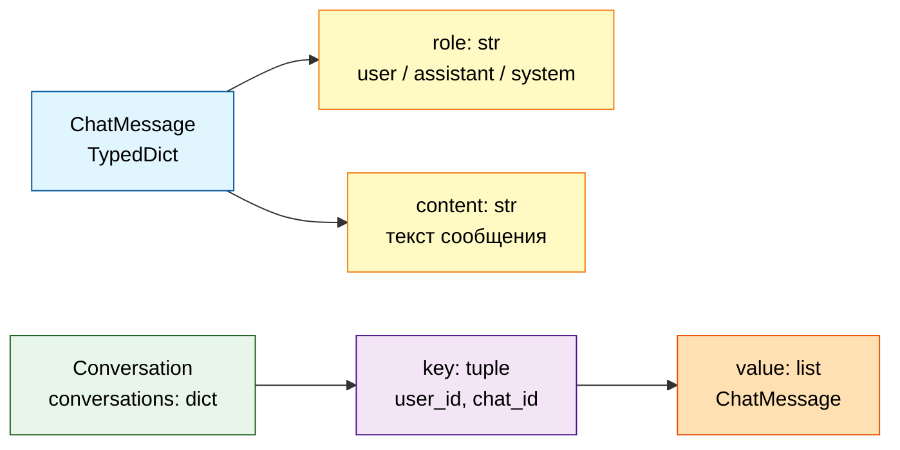
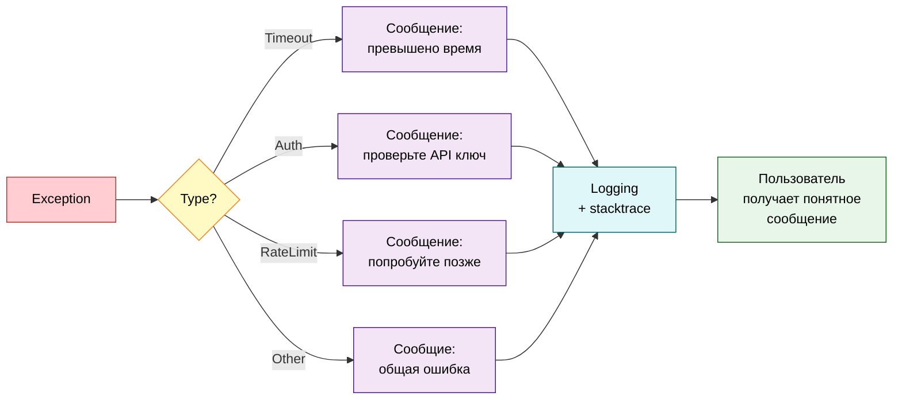

# Architecture Overview

Обзор архитектуры Systech AIDD Bot.

## High-Level Architecture



## Component Responsibilities

### TelegramBot (`bot.py`)
- Инициализация aiogram Bot и Dispatcher
- Регистрация обработчиков команд и сообщений
- Управление polling режимом
- Отображение индикатора "печатает..."

### CommandHandler (`command_handler.py`)
Обработка команд бота:
- `/start` - приветствие
- `/help` - справка
- `/clear` или `/new` - очистка истории
- `/role` - описание роли нутрициолога

### MessageHandler (`message_handler.py`)
Обработка текстовых сообщений:
- Получение истории диалога
- Формирование запроса к LLM
- Сохранение диалога в историю

### LLMClient (`llm_client.py`)
Интеграция с Openrouter API:
- Загрузка системного промпта из файла
- Отправка запросов к LLM
- Обработка ошибок (timeout, auth, rate limit)

### Conversation (`conversation.py`)
Хранение истории диалогов:
- In-memory storage (dict)
- Ключ: (user_id, chat_id)
- Лимит: последние 10 сообщений

### Config (`config.py`)
Конфигурация через Pydantic:
- Загрузка из `.env`
- Валидация параметров
- Значения по умолчанию

## Message Flow

Полный путь сообщения от пользователя до ответа:

```mermaid
sequenceDiagram
    participant U as 👤 User
    participant B as 🤖 Bot
    participant MH as 💬 MessageHandler
    participant C as 📚 Conversation
    participant L as 🧠 LLMClient
    participant O as ☁️ Openrouter
    
    U->>B: текстовое сообщение
    B->>B: показать "печатает..."
    B->>MH: handle_message(user_id, chat_id, text)
    MH->>C: get_history(user_id, chat_id)
    C-->>MH: history (0-10 messages)
    MH->>MH: добавить текущее сообщение
    MH->>L: get_response(messages)
    L->>L: добавить system prompt
    L->>O: chat.completions.create()
    O-->>L: response
    L-->>MH: answer text
    MH->>C: add_message(user, text)
    MH->>C: add_message(assistant, answer)
    MH-->>B: response
    B->>U: ответ бота
    
    box rgba(255, 235, 238, 0.3) Telegram
    U
    end
    box rgba(232, 245, 233, 0.3) Backend
    B
    MH
    C
    L
    end
    box rgba(255, 243, 224, 0.3) External API
    O
    end
```

## SOLID Principles

### Single Responsibility Principle (SRP)
Каждый класс имеет одну ответственность:
- `TelegramBot` - только координация
- `CommandHandler` - только команды
- `MessageHandler` - только сообщения
- `LLMClient` - только LLM API
- `Conversation` - только история
- `Config` - только конфигурация

### Dependency Inversion Principle (DIP)

Использование Protocol интерфейсов для абстракции:



**Преимущества:**
- Легко заменить реализацию (например, Conversation → PostgreSQL)
- Простое тестирование с моками
- Слабая связанность компонентов

## Data Model



**ChatMessage:**
```python
{
    "role": "user",           # user / assistant / system
    "content": "текст сообщения"
}
```

**Conversation storage:**
```python
{
    (user_id, chat_id): [
        {"role": "user", "content": "привет"},
        {"role": "assistant", "content": "Здравствуйте!"},
        ...  # максимум 10 сообщений
    ]
}
```

## Tech Stack

- **Python 3.11+** - язык программирования
- **aiogram 3.x** - Telegram Bot API (polling)
- **openai SDK** - клиент для Openrouter API
- **pydantic 2.x** - валидация конфигурации

**Dev tools:**
- **ruff** - форматтер + линтер
- **mypy** - type checker (strict mode)
- **pytest** - тестирование

## Design Patterns

### Dependency Injection
Явная инъекция через конструктор:
```python
llm_client = LLMClient(...)
conversation = Conversation(...)
message_handler = MessageHandler(llm_client, conversation)
```

### Protocol (Strategy)
Абстракции через `typing.Protocol` вместо наследования

### TypedDict
Структуры данных без классов

## Error Handling

Graceful degradation - бот продолжает работать при ошибках:



## Limitations

**Текущие ограничения системы:**
- История диалогов хранится в памяти (пропадает при перезапуске)
- Максимум 10 сообщений в истории
- Polling режим (не webhooks)
- Нет персистентности
- Нет мониторинга

## Next Steps

- 🗺️ [Codebase Tour](04_codebase_tour.md) - детальный обзор файлов
- ⚙️ [Configuration & Secrets](07_configuration_secrets.md) - настройка конфигурации
- 🧪 [Testing Guide](09_testing_guide.md) - как тестируется код

