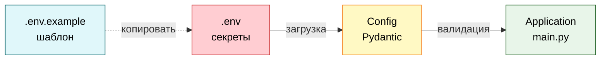

# Configuration & Secrets

Все о конфигурации приложения и управлении секретами.

## Config Class

Конфигурация реализована через `pydantic_settings.BaseSettings`:

```python
from pydantic_settings import BaseSettings

class Config(BaseSettings):
    telegram_bot_token: str
    openrouter_api_key: str
    # ...
```

**Преимущества:**
- ✅ Автоматическая загрузка из `.env`
- ✅ Валидация типов и constraints
- ✅ Type-safe (mypy strict mode)
- ✅ Понятные сообщения об ошибках

## Environment Variables

### Обязательные параметры

```bash
# Telegram Bot
TELEGRAM_BOT_TOKEN=1234567890:ABCdefGHIjklMNOpqrsTUVwxyz

# Openrouter API
OPENROUTER_API_KEY=sk-or-v1-xxxxxxxxxxxxxxxxxxxxxxxxxxxxx
```

**Где получить:**
- `TELEGRAM_BOT_TOKEN` - [@BotFather](https://t.me/botfather) в Telegram
- `OPENROUTER_API_KEY` - [openrouter.ai](https://openrouter.ai/)

### Опциональные параметры

```bash
# LLM Settings
LLM_MODEL=openai/gpt-oss-20b:free
LLM_TEMPERATURE=0.7
LLM_MAX_TOKENS=1000
LLM_TIMEOUT=30

# Conversation
MAX_HISTORY_MESSAGES=10

# System Prompt
SYSTEM_PROMPT_PATH=prompts/nutritionist.txt
```

## Parameter Reference

| Параметр | Тип | По умолчанию | Constraints | Описание |
|----------|-----|--------------|-------------|----------|
| `TELEGRAM_BOT_TOKEN` | `str` | - | min_length=1 | Токен Telegram бота |
| `OPENROUTER_API_KEY` | `str` | - | min_length=1 | API ключ Openrouter |
| `LLM_MODEL` | `str` | `openai/gpt-oss-20b:free` | min_length=1 | Модель LLM |
| `LLM_TEMPERATURE` | `float` | `0.7` | 0.0-2.0 | Температура генерации |
| `LLM_MAX_TOKENS` | `int` | `1000` | 1-100000 | Макс. токенов ответа |
| `LLM_TIMEOUT` | `int` | `30` | 1-300 | Таймаут запроса (сек) |
| `MAX_HISTORY_MESSAGES` | `int` | `10` | 1-100 | Макс. сообщений истории |
| `SYSTEM_PROMPT_PATH` | `str` | `prompts/nutritionist.txt` | min_length=1 | Путь к промпту |

## Validation

### Type Conversion

Pydantic автоматически приводит типы:
```bash
# .env
LLM_TEMPERATURE=0.7   # строка

# Python
config.llm_temperature  # float 0.7
```

### Constraints

**PositiveFloat (0.0-2.0):**
```python
llm_temperature: PositiveFloat = Field(
    default=0.7, ge=0.0, le=2.0
)
```

**PositiveInt (1-100000):**
```python
llm_max_tokens: PositiveInt = Field(
    default=1000, ge=1, le=100000
)
```

### Error Messages

При невалидных данных получаете понятное сообщение:

```python
# Отсутствует TELEGRAM_BOT_TOKEN
ValidationError: 1 validation error for Config
telegram_bot_token
  Field required [type=missing, ...]

# LLM_TEMPERATURE вне диапазона
ValidationError: 1 validation error for Config
llm_temperature
  Input should be greater than or equal to 0.0 [type=greater_than_equal, ...]
```

## File Structure



### `.env` - Production Secrets

**Содержит:** реальные токены и ключи

**Расположение:** корень проекта

**Git:** добавлен в `.gitignore` (НЕ коммитить!)

**Пример:**
```bash
TELEGRAM_BOT_TOKEN=1234567890:ABCdefGHIjklMNOpqrsTUVwxyz
OPENROUTER_API_KEY=sk-or-v1-xxxxxxxxxxxxxxxxxxxxxxxxxxxxx
```

### `.env.example` - Template

**Содержит:** шаблон с placeholder значениями

**Расположение:** корень проекта

**Git:** коммитится в репозиторий

**Пример:**
```bash
TELEGRAM_BOT_TOKEN=your_telegram_bot_token_here
OPENROUTER_API_KEY=your_openrouter_api_key_here
LLM_MODEL=openai/gpt-oss-20b:free
```

## Loading Process

```mermaid
sequenceDiagram
    participant M as main.py
    participant C as Config
    participant P as Pydantic
    participant E as .env file
    participant OS as OS env vars
    
    M->>C: config = Config()
    C->>P: BaseSettings.__init__()
    P->>E: читать .env
    E-->>P: переменные
    P->>OS: читать OS env
    OS-->>P: переменные
    P->>P: валидация + type conversion
    alt Валидация OK
        P-->>C: config object
        C-->>M: готовый config
    else Ошибка валидации
        P-->>M: ValidationError
        M->>M: exit(1)
    end
    
    box rgba(232, 245, 233, 0.3) Application
    M
    C
    end
    box rgba(255, 243, 224, 0.3) Pydantic
    P
    end
    box rgba(255, 235, 238, 0.3) External
    E
    OS
    end
```

**Порядок приоритета:**
1. OS environment variables (highest)
2. `.env` file
3. Default values (lowest)

## Configuration in Code

### Инициализация

```python
# main.py
from src.config import Config

config = Config()  # Автоматически загружает из .env
```

### Использование

```python
# Создание LLMClient с параметрами из config
llm_client = LLMClient(
    api_key=config.openrouter_api_key,
    model=config.llm_model,
    temperature=config.llm_temperature,
    max_tokens=config.llm_max_tokens,
    timeout=config.llm_timeout,
    system_prompt_path=config.system_prompt_path,
)
```

## Secrets Management

### Current Approach

**Хранение:** `.env` файл в корне проекта

**Защита:** `.gitignore` предотвращает коммит

**Ограничения:**
- ❌ Нет шифрования
- ❌ Нет ротации ключей
- ❌ Нет централизованного управления

### Best Practices

**✅ DO:**
- Использовать `.env` для локальной разработки
- Добавить `.env` в `.gitignore`
- Создать `.env.example` с шаблоном
- Не хардкодить секреты в коде

**❌ DON'T:**
- Коммитить `.env` в git
- Хардкодить токены в коде
- Писать секреты в логи
- Передавать секреты в URL

## Model Configuration

### Доступные модели (Openrouter)

**Free модели:**
```bash
LLM_MODEL=openai/gpt-oss-20b:free
LLM_MODEL=google/gemma-7b-it:free
LLM_MODEL=meta-llama/llama-3-8b-instruct:free
```

**Платные модели:**
```bash
LLM_MODEL=anthropic/claude-3.5-sonnet
LLM_MODEL=openai/gpt-4-turbo
LLM_MODEL=google/gemini-pro-1.5
```

Полный список: [openrouter.ai/docs#models](https://openrouter.ai/docs#models)

### Temperature

```bash
LLM_TEMPERATURE=0.0   # Детерминированный (всегда одинаковый ответ)
LLM_TEMPERATURE=0.7   # Сбалансированный (рекомендуется)
LLM_TEMPERATURE=1.5   # Креативный (более разнообразные ответы)
```

### Max Tokens

```bash
LLM_MAX_TOKENS=500    # Короткие ответы
LLM_MAX_TOKENS=1000   # Средние ответы (по умолчанию)
LLM_MAX_TOKENS=2000   # Длинные ответы
```

## System Prompt

### Configuration

```bash
SYSTEM_PROMPT_PATH=prompts/nutritionist.txt
```

### File Format

**Расположение:** `prompts/nutritionist.txt`

**Формат:** plain text, UTF-8

**Как работает:**
1. Загружается при инициализации `LLMClient`
2. Добавляется как system message в каждый запрос
3. Определяет роль и поведение бота

### Custom Prompts

Создать новый промпт:
```bash
# 1. Создать файл
echo "Ты эксперт по фитнесу..." > prompts/fitness.txt

# 2. Изменить .env
SYSTEM_PROMPT_PATH=prompts/fitness.txt

# 3. Перезапустить бота
make run
```

## Troubleshooting

### Ошибка: Field required

**Проблема:** Отсутствует обязательный параметр

**Решение:**
```bash
# Добавить в .env
TELEGRAM_BOT_TOKEN=your_token_here
OPENROUTER_API_KEY=your_key_here
```

### Ошибка: Input should be greater than or equal to 0.0

**Проблема:** Значение вне допустимого диапазона

**Решение:**
```bash
# Исправить значение в .env
LLM_TEMPERATURE=0.7  # вместо -1 или 3
```

### Ошибка: System prompt file not found

**Проблема:** Файл промпта не найден

**Решение:**
```bash
# Проверить существование файла
ls prompts/nutritionist.txt

# Или изменить путь в .env
SYSTEM_PROMPT_PATH=prompts/custom.txt
```

## Next Steps

- 🔨 [Development Workflow](08_development_workflow.md) - работа с кодом
- 🧪 [Testing Guide](09_testing_guide.md) - тестирование конфигурации

