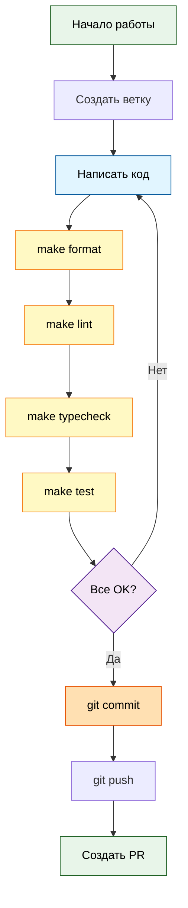

# Development Workflow

Day-to-day рабочий процесс разработки.

## Quick Reference

```bash
# Setup
make install              # Установить зависимости

# Development
make run                  # Запустить бота
make format               # Форматирование кода
make lint                 # Проверка линтером
make typecheck            # Проверка типов
make test                 # Запустить тесты

# Before commit
make quality              # Полная проверка (format + lint + typecheck + test)
```

## Development Flow



## Code Standards

### Type Hints

**Обязательно везде:**
```python
# ✅ Хорошо
def add_message(self, user_id: int, chat_id: int, role: str, content: str) -> None:
    pass

async def get_response(self, messages: list[ChatMessage]) -> str:
    pass

# ❌ Плохо
def add_message(self, user_id, chat_id, role, content):
    pass
```

### Docstrings

**На русском языке:**
```python
class MessageHandler:
    """Обработка текстовых сообщений от пользователя."""

    async def handle_message(self, user_id: int, chat_id: int, text: str) -> str:
        """Обработать входящее сообщение и вернуть ответ от LLM."""
        pass
```

### File Organization

**1 класс = 1 файл:**
```
bot.py              # TelegramBot
command_handler.py  # CommandHandler
message_handler.py  # MessageHandler
```

### Naming Conventions

```python
# Файлы и функции
snake_case.py
def handle_message():
    pass

# Классы
class MessageHandler:
    pass

# Константы
MAX_HISTORY_MESSAGES = 10
```

## Make Commands

### Installation

```bash
make install
```

Выполняет: `uv sync --all-extras`

Устанавливает:
- Production dependencies
- Dev dependencies (ruff, mypy, pytest)

---

### Running

```bash
make run
```

Выполняет: `uv run python main.py`

Запускает бота в polling режиме.

**Для остановки:** `Ctrl+C`

---

### Code Formatting

```bash
make format
```

Выполняет: `uv run ruff format src/ tests/ main.py`

**Что делает:**
- Форматирует код по правилам ruff
- Line length: 100 символов
- Автоматически исправляет

**Когда запускать:** перед коммитом

---

### Linting

```bash
make lint
```

Выполняет: `uv run ruff check src/ tests/ main.py`

**Что проверяет:**
- Стиль кода (pycodestyle)
- Ошибки (pyflakes)
- Сортировка импортов (isort)
- Naming conventions (pep8-naming)
- Упрощения кода (flake8-simplify)

**Исправить автоматически:**
```bash
make lint-fix
```

---

### Type Checking

```bash
make typecheck
```

Выполняет: `uv run mypy src/ main.py`

**Что проверяет:**
- Type hints корректны
- Strict mode (самая строгая проверка)
- Protocol реализованы правильно

**Типичные ошибки:**
```python
# Ошибка: Missing return type
def get_response(messages):  # ❌
    pass

def get_response(messages: list[ChatMessage]) -> str:  # ✅
    pass
```

---

### Testing

```bash
make test
```

Выполняет: `uv run pytest tests/ -v`

**Запуск с coverage:**
```bash
make test-cov
```

Создает HTML отчет: `htmlcov/index.html`

---

### Quality Check

```bash
make quality
```

Выполняет все проверки последовательно:
1. `make format` - форматирование
2. `make lint` - линтинг
3. `make typecheck` - type checking
4. `make test` - тесты

**Когда запускать:** перед каждым коммитом

**Без тестов:**
```bash
make quality-no-test
```

---

### Clean

```bash
make clean
```

Удаляет временные файлы:
- `.venv/` - виртуальное окружение
- `__pycache__/` - Python cache
- `.pytest_cache/` - pytest cache
- `.mypy_cache/` - mypy cache
- `.ruff_cache/` - ruff cache
- `htmlcov/` - coverage отчеты

## Git Workflow

### Branch Strategy

```bash
# Создать feature ветку
git checkout -b feature/add-new-command

# Работать в ветке
# ...

# Создать PR в main
```

### Commit Messages

**Формат:** `<type>: <description>`

**Типы:**
- `feat:` - новая функциональность
- `fix:` - исправление бага
- `refactor:` - рефакторинг
- `test:` - добавление тестов
- `docs:` - документация
- `chore:` - техническая работа
- `style:` - форматирование

**Примеры:**
```bash
git commit -m "feat: add /role command for nutritionist"
git commit -m "fix: handle empty system prompt file"
git commit -m "refactor: extract Protocol interfaces for DIP"
git commit -m "test: add unit tests for Conversation class"
git commit -m "docs: update architecture overview"
```

### Before Commit Checklist

- [ ] Код работает (`make run`)
- [ ] Форматирование применено (`make format`)
- [ ] Линтер не показывает ошибок (`make lint`)
- [ ] Type checker проходит (`make typecheck`)
- [ ] Тесты проходят (`make test`)
- [ ] Новый код покрыт тестами
- [ ] Документация обновлена (если нужно)

**Быстрая проверка:**
```bash
make quality
```

## Debugging

### Logging

Все события логируются автоматически:

```python
import logging

logger = logging.getLogger(__name__)

logger.info("Received message from user {user_id}")
logger.error("LLM API error: {e}", exc_info=True)
```

**Уровни:**
- `INFO` - нормальная работа
- `ERROR` - ошибки с stacktrace

### Run with Logs

```bash
make run
```

Видим в реальном времени:
```
[2025-10-16 12:00:00] [INFO] [bot] - Bot started successfully
[2025-10-16 12:00:15] [INFO] [message_handler] - Received message from user 123456
```

### Testing Locally

```bash
# 1. Запустить бота
make run

# 2. В Telegram:
# - Найти бота
# - Отправить /start
# - Протестировать команды
# - Отправить текстовые сообщения

# 3. Проверить логи в консоли
```

## Working with Dependencies

### Add New Dependency

```bash
# Добавить в pyproject.toml
[project]
dependencies = [
    "aiogram>=3.0.0",
    "new-package>=1.0.0",  # новая зависимость
]

# Установить
make install
```

### Add Dev Dependency

```bash
# Добавить в pyproject.toml
[project.optional-dependencies]
dev = [
    "ruff>=0.8.0",
    "new-dev-tool>=1.0.0",  # новая dev зависимость
]

# Установить
make install
```

### Lock Dependencies

uv автоматически обновляет `uv.lock` при изменении `pyproject.toml`.

## Common Tasks

### Add New Command

1. **Открыть `src/command_handler.py`**
2. **Добавить метод:**
   ```python
   async def my_command(self, message: Message) -> None:
       """Команда /my_command."""
       await message.answer("Response")
   ```
3. **Зарегистрировать в `src/bot.py`:**
   ```python
   self.dp.message(Command("my_command"))(self.command_handler.my_command)
   ```
4. **Добавить тест в `tests/unit/test_command_handler.py`**
5. **Запустить `make quality`**

### Add New LLM Model

1. **Изменить `.env`:**
   ```bash
   LLM_MODEL=anthropic/claude-3.5-sonnet
   ```
2. **Перезапустить бота:**
   ```bash
   make run
   ```

### Change System Prompt

1. **Отредактировать `prompts/nutritionist.txt`**
2. **Или создать новый файл:**
   ```bash
   echo "Ты эксперт по..." > prompts/custom.txt
   ```
3. **Изменить `.env`:**
   ```bash
   SYSTEM_PROMPT_PATH=prompts/custom.txt
   ```
4. **Перезапустить бота**

## IDE Setup (Cursor/VS Code)

### Recommended Extensions

- Python
- Pylance
- Ruff

### Settings

Проект настроен автоматически через `pyproject.toml`.

**Format on Save:** включен для ruff

**Linter:** ruff показывает ошибки в реальном времени

**Type Checker:** mypy подсвечивает проблемы типизации

## Next Steps

- 🧪 [Testing Guide](09_testing_guide.md) - как писать тесты
- 📖 [Codebase Tour](04_codebase_tour.md) - структура кода
- ⚙️ [Configuration & Secrets](07_configuration_secrets.md) - настройка конфигурации

