# Documentation Guides

Полный набор гайдов для работы с проектом Systech AIDD Bot.

## 🚀 Getting Started

Начните здесь, если впервые работаете с проектом:

### [Getting Started](01_getting_started.md)
Быстрый старт: от установки до запущенного бота за 5 минут.

**Что внутри:**
- Prerequisites
- Установка зависимостей
- Настройка `.env`
- Первый запуск
- Troubleshooting

---

## 📚 Understanding the System

Изучите архитектуру и структуру проекта:

### [Visual Architecture Guide](02_visual_architecture.md)
🎨 Визуальное представление архитектуры с 12 типами диаграмм (Mermaid).

**Что внутри:**
- High-level architecture
- Sequence diagrams (message flow)
- Component & class diagrams
- State machines & data flows
- Deployment view
- User journey
- Tech stack & design patterns

### [Architecture Overview](03_architecture_overview.md)
Обзор архитектуры с диаграммами и паттернами проектирования.

**Что внутри:**
- High-level архитектура (диаграммы)
- Компоненты и их ответственность
- Message flow
- SOLID принципы
- Data model
- Tech stack

### [Codebase Tour](04_codebase_tour.md)
Guided tour по структуре кода - где что находится и как работает.

**Что внутри:**
- Структура проекта
- Описание каждого модуля
- Публичные API
- Конфигурационные файлы
- Тестовая структура
- Где искать что

---

## ⚙️ Configuration & Development

Настройте окружение и начните разработку:

### [Configuration & Secrets](07_configuration_secrets.md)
Все о конфигурации, переменных окружения и секретах.

**Что внутри:**
- Config class (Pydantic)
- Environment variables
- Parameter reference
- Validation
- Secrets management
- System prompts

### [Development Workflow](08_development_workflow.md)
Day-to-day рабочий процесс разработки.

**Что внутри:**
- Quick reference (команды)
- Development flow
- Code standards
- Make commands
- Git workflow
- Debugging
- Common tasks

### [Testing Guide](09_testing_guide.md)
Как писать и запускать тесты.

**Что внутри:**
- Test structure
- Running tests
- Writing tests
- Test types (unit)
- Fixtures & mocking
- Coverage
- Best practices

---

## 📖 Learning Path

Рекомендуемый порядок изучения для новых разработчиков:

```mermaid
graph LR
    A[1. Getting Started] --> B[2. Architecture Overview]
    B --> C[3. Codebase Tour]
    C --> D[4. Configuration]
    D --> E[5. Development Workflow]
    E --> F[6. Testing Guide]
    
    style A fill:#e8f5e9,stroke:#1b5e20,color:#000
    style B fill:#e1f5ff,stroke:#01579b,color:#000
    style C fill:#fff9c4,stroke:#f57f17,color:#000
    style D fill:#f3e5f5,stroke:#4a148c,color:#000
    style E fill:#ffe0b2,stroke:#e65100,color:#000
    style F fill:#e0f7fa,stroke:#006064,color:#000
```



### Day 1: Быстрый старт
1. [Getting Started](01_getting_started.md) - запустить бота
2. [Architecture Overview](03_architecture_overview.md) - понять как устроено

### Day 2: Погружение в код
3. [Codebase Tour](04_codebase_tour.md) - изучить структуру
4. [Configuration & Secrets](07_configuration_secrets.md) - разобраться с настройками

### Day 3: Начало разработки
5. [Development Workflow](08_development_workflow.md) - workflow разработки
6. [Testing Guide](09_testing_guide.md) - как тестировать

### Week 1: Практика
- Исправить мелкий баг
- Добавить новую команду
- Написать тест
- Создать PR

---

## 🔍 Quick Reference

### Команды Make

```bash
# Setup
make install              # Установить зависимости

# Running
make run                  # Запустить бота

# Quality checks
make format               # Форматирование
make lint                 # Линтинг
make typecheck            # Type checking
make test                 # Тесты
make quality              # Полная проверка
```

### Структура проекта

```
systech-aidd/
├── main.py               # Точка входа
├── src/                  # Исходный код
│   ├── bot.py
│   ├── command_handler.py
│   ├── message_handler.py
│   ├── llm_client.py
│   ├── conversation.py
│   ├── config.py
│   ├── protocols.py
│   └── types.py
├── tests/                # Тесты
├── prompts/              # Системные промпты
├── docs/                 # Документация
└── .env                  # Секреты
```

### Основные концепции

- **Архитектура:** Слабая связанность, SOLID, Protocol для DIP
- **Type Safety:** Строгая типизация (mypy strict mode)
- **Testing:** 70%+ coverage, моки для внешних зависимостей
- **Configuration:** Pydantic BaseSettings с валидацией
- **Storage:** In-memory (dict), история 10 сообщений

---

## 📚 Additional Documentation

### Проектная документация

- [Vision](../vision.md) - техническое видение проекта
- [Conventions](../conventions.md) - соглашения по разработке
- [Task List](../tasklist.md) - план основной разработки
- [Tech Debt](../tasklist_tech_dept.md) - план устранения техдолга

### Reviews

- [Review #0001](../reviews/review_0001.md) - полное ревью проекта

---

## 🤝 Getting Help

**Вопросы по проекту:**
1. Проверьте соответствующий гайд
2. Посмотрите [Conventions](../conventions.md)
3. Изучите [Vision](../vision.md)

**Технические проблемы:**
1. Troubleshooting секции в гайдах
2. Логи бота (`make run`)
3. Тесты (`make test`)

---

## 📝 Contributing to Docs

При обновлении документации:

1. ✅ Сохраняйте краткость и простоту
2. ✅ Используйте mermaid диаграммы где уместно
3. ✅ Описывайте только текущее состояние
4. ✅ Избегайте оверинжиниринга
5. ✅ Обновляйте этот README при добавлении гайдов

---

**Последнее обновление:** 2025-10-16

